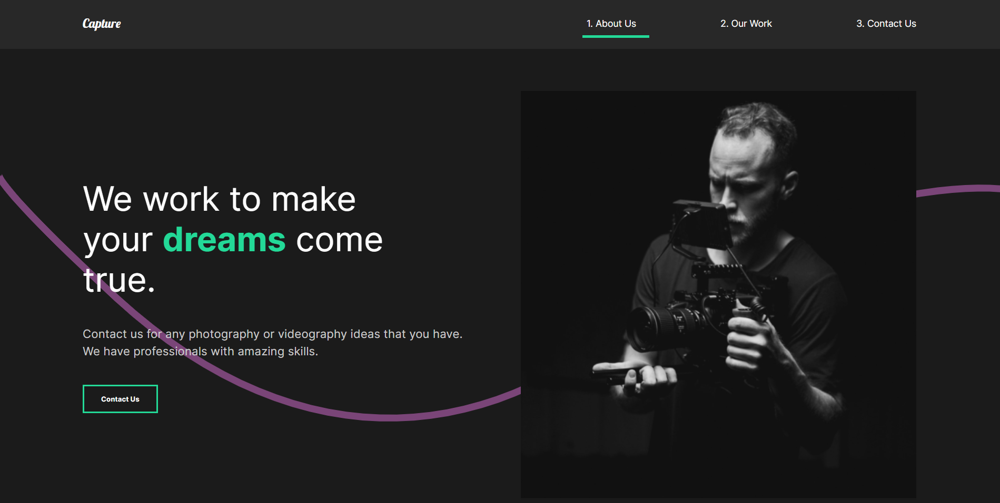

# Capture [Demo](https://joaquimgi.github.io/capture-webapp/)

Cool website made with React JS, Styled Components and Framer Motion animation. This website was made following a course from Dev Ed but with some refactoring from me to remove redundant code and some more animation using Framer Motion.

<a href="https://joaquimgi.github.io/capture-webapp/">

</a>

## Main tech used to complete this project

- React.js
- Styled Components
- Framer Motion for animations
- Media queries

### Installation

1- Clone this repo
2- Install the dependencies and devDependencies and start the application.

#### Using NPM

```sh
$ cd capture-webapps
$ npm install
$ npm run start
```
